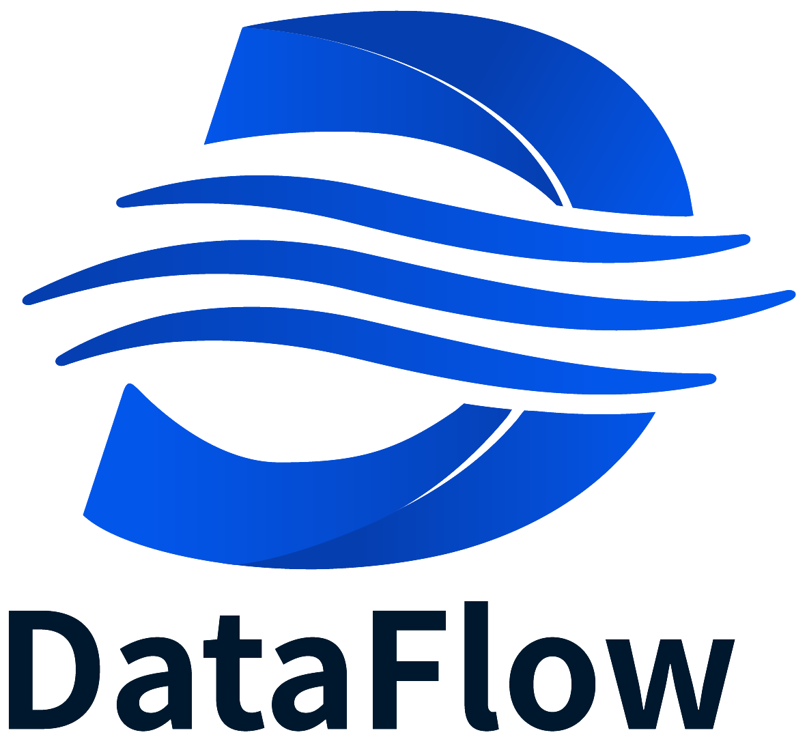

<p align="center">
  
</p>

# DataFlow WebUI 前端项目

这是 DataFlow 的 **前端界面项目**，使用 **Vue 3 + Vite** 构建。

👉 如果你**完全不懂前端开发**，也没关系，只要**按顺序一步步操作**就能成功运行。

---

# 🧠 你现在在做什么？（大概理解一下）

你将要安装下面这些东西：

| 工具          | 作用          | 为什么需要            |
| ----------- | ----------- | ---------------- |
| **Node.js** | 运行前端构建工具    | 前端项目必须依赖         |
| **NVM**     | Node 版本管理工具 | 确保大家用同一个 Node 版本 |
| **Yarn**    | 包管理器        | 下载项目所需依赖         |
| **Vite**    | 前端开发服务器     | 用来本地运行页面         |

---

# 🖥 0️⃣ 推荐编辑器（可选）

建议安装：

* **VS Code**：[https://code.visualstudio.com/](https://code.visualstudio.com/)
* 安装插件 **Volar**（支持 Vue）
* 如果装了 **Vetur**，请禁用

---

# 🧩 1️⃣ 安装 NVM（Node 版本管理工具）

### Mac / Linux

```bash
# 官方源
curl -o- https://raw.githubusercontent.com/nvm-sh/nvm/v0.39.7/install.sh | bash

# 国内镜像（更快）
curl -so- https://gitee.com/mirrors/nvm/raw/v0.39.7/install.sh | bash
```

安装后刷新终端：

```bash
# bash
source ~/.bashrc

# zsh
source ~/.zshrc
```

---

# 🟢 2️⃣ 安装 Node.js（必须是 20 版本）

```bash
nvm install 20
nvm use 20
nvm alias default 20
```

检查是否成功：

```bash
node -v   # 应显示 v20.x.x
npm -v
```

---

# 📦 3️⃣ 安装 Yarn

```bash
corepack enable
corepack prepare yarn@stable --activate
yarn -v
```

---

# 📥 4️⃣ 下载项目并安装依赖

进入项目目录：

```bash
cd DataFlow-WebUI/frontend
```

安装依赖：

```bash
yarn
```

第一次可能需要几分钟。

---

# 🔌 5️⃣ 连接后端接口（非常重要）

前端需要连接后端 FastAPI。

打开文件：

```
vite.config.js
```

找到：

```js
proxy: {
    '/api': {
        target: 'http://100.64.0.91:8000/',
        changeOrigin: true,
        rewrite: path => path.replace(/^\/api/, '')
    }
}
```

👉 如果你的后端地址不同，把 IP 改成你的服务器地址。

---

# ▶️ 6️⃣ 启动项目（本地运行）

```bash
yarn dev
```

终端会显示：

```
Local: http://localhost:5173/
```

浏览器打开这个地址 🎉
修改代码页面会自动刷新。

---

# 🏗 7️⃣ 打包部署

### 第一步：设置后端地址

在 `.env.production` 中：

```
VITE_BACKEND_URL=http://你的后端地址:8000
```

### 第二步：打包

```bash
yarn build
```

会生成 `dist/` 文件夹，这就是部署用的文件。

---

# 📂 项目结构（简单理解）

```
src/
├── axios/        后端接口请求配置
├── components/   小组件
├── views/        页面
├── router/       页面路由
├── hooks/        公共逻辑
├── App.vue       根组件
└── main.js       入口文件
```

---

# 🔄 后端接口变更后如何更新

如果后端 API 更新：

```bash
yarn api
```

它会自动更新前端接口代码。

---

# 📡 前端如何调用后端 API

### 写法 1（传统）

```js
this.$api.datasets.list_datasets().then(res => {
    console.log(res)
})
```

### 写法 2（推荐）

```js
import { useGlobal } from "@/hooks/general/useGlobal";
const { $api } = useGlobal();

$api.datasets.list_datasets().then(res => {
    console.log(res)
});
```

---

# 🧰 可用的全局方法

| 名称        | 作用   |
| --------- | ---- |
| `$api`    | 后端接口 |
| `$axios`  | 请求工具 |
| `$router` | 路由   |
| `$Go`     | 页面跳转 |
| `$Back`   | 返回   |
| `$Jump`   | 新开页面 |

---

# 🎨 Flow 边规则

格式：

```
<属性名>::<source或target>::<边类型>
```

例：

```
node::source::node
key_name::source::run_key
```

---

# ❗如果启动失败

检查：

1. Node 版本是不是 **20**
2. 后端服务是否启动
3. `vite.config.js` IP 是否正确
4. 重新安装依赖：

```bash
rm -rf node_modules
yarn
```

## 🔹 UI 组件库

本项目使用 **VFluent3** 组件库。
这是一个基于 Vue 3、参考 Microsoft Fluent Design 的 UI 组件库，风格简洁统一，适合在 Vue + Vite 项目中构建现代化界面。

GitHub：[https://github.com/Creator-SN/VFluent3](https://github.com/Creator-SN/VFluent3)
